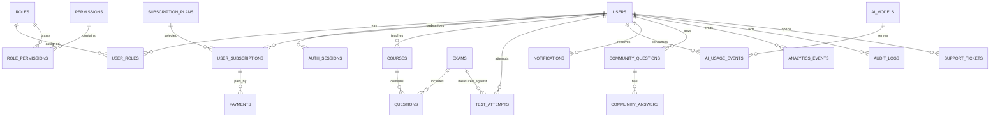

# JagdiSu Production Architecture

## Complete System Architecture

JagdiSu should run as a cloud-native EdTech platform with a Next.js 15 web app, Spring Boot 3 microservices, MySQL as the system-of-record database, Redis for cache/session/rate-limit state, Kafka for asynchronous events, Elasticsearch for search, S3/MinIO for files, and Prometheus/Grafana/ELK for observability.

Current repository status: this is not yet implemented as separate Spring Boot microservices. The `backend` directory contains one Maven project, one `@SpringBootApplication`, one `application.yml`, and one deployable backend artifact. Domain packages such as `auth`, `ai`, `community`, `subscription`, and `admin` are modules inside a modular monolith. The microservice layout below is the target production architecture.

```text
Users
  -> CDN/WAF
  -> Next.js 15 Frontend
  -> Spring Cloud Gateway
  -> Auth, User, Course, Exam, Question, Test, AI, OCR, Payment,
     Notification, Community, Analytics, Current Affairs, Admin, File services
  -> MySQL, Redis, Kafka, Elasticsearch, S3/MinIO
```

## Folder Structure

```text
JagdiSu/
  frontend/
    app/
    components/
    features/
    lib/
    store/
  backend/
    gateway-service/
    auth-service/
    user-service/
    course-service/
    exam-service/
    question-service/
    test-service/
    ai-service/
    ocr-service/
    payment-service/
    notification-service/
    community-service/
    analytics-service/
    current-affairs-service/
    admin-service/
    file-service/
    shared/
  infra/
    docker/
    kubernetes/
    helm/
    monitoring/
    ci/
  docs/
```

The current repository is a modular monolith starter, so packages under `backend/src/main/java/com/jdsu/quiz` map to early versions of these services but are not independently deployable services yet.

## Database ER Diagram



## MySQL Schema

The starter MySQL schema lives in `backend/src/main/resources/schema.sql`. It includes:

- Core users and feedback.
- RBAC tables for Student, Mentor, Teacher, Content Creator, Moderator, Admin, and Super Admin.
- Multi-device auth sessions and verification tokens for OTP, email, mobile, forgot password, and reset password flows.
- Subscription plans, user subscriptions, payments, coupons, wallet, and invoices-ready payment metadata.
- Course, exam, question, and test-attempt tables.
- AI model registry and AI usage event tracking.
- Notifications, audit logs, support tickets, analytics events, community votes, and followers.

## API Design

```text
POST /api/auth/signup
POST /api/auth/login
POST /api/auth/google
POST /api/auth/github
POST /api/auth/otp/send
POST /api/auth/otp/verify
POST /api/auth/forgot-password
POST /api/auth/reset-password
POST /api/auth/refresh
POST /api/auth/logout

GET  /api/users/me
PATCH /api/users/me
GET  /api/admin/dashboard
GET  /api/admin/users
PATCH /api/admin/users/{id}/roles

GET  /api/courses
POST /api/courses
GET  /api/exams
POST /api/questions
POST /api/tests/attempts

POST /api/quiz/generate
POST /api/notes/evaluate
POST /api/topic-notes/generate

GET  /api/subscription/me
GET  /api/subscription/plans
POST /api/payments/razorpay/order
POST /api/payments/stripe/session
POST /api/payments/webhooks/razorpay
POST /api/payments/webhooks/stripe

POST /api/notifications
GET  /api/community/questions
POST /api/community/questions
POST /api/analytics/events
GET  /api/health
GET  /actuator/prometheus
```

## Frontend Architecture

Use Next.js App Router with TypeScript, Tailwind CSS, ShadCN UI, React Query for server state, and Redux Toolkit only for cross-page client state such as auth shell, UI preferences, and exam-attempt runtime state. Keep learning flows SSR-friendly, use dynamic imports for AI-heavy panels, optimize images, and disable production source maps.

## Backend Architecture

Each Spring Boot service owns its bounded context and database migrations. The gateway handles routing, JWT validation, CORS, request IDs, rate limiting, and API shielding. Services communicate synchronously through REST for read flows and asynchronously through Kafka for events such as payment success, notification send, course published, AI usage recorded, and test completed.

## Security Architecture

- OAuth2 for Google and GitHub login.
- JWT access tokens with short TTL and refresh tokens stored as hashes in `auth_sessions`.
- RBAC with role and permission tables.
- Rate limiting at WAF, gateway, and service level.
- CSRF protection for browser-cookie flows.
- Strict input validation, prepared SQL, output encoding, and security headers.
- Prompt-injection protection through system prompts, retrieval boundaries, tool allowlists, and AI output moderation.
- Signed URLs, watermarking, DRM/HLS for premium video, and download throttling.
- Production source maps disabled, minification enabled, chunk splitting through Next.js, and no secrets in frontend bundles.

## Microservice Communication Flow

```text
Login:
Frontend -> Gateway -> Auth Service -> MySQL/Redis -> JWT + refresh token

Quiz generation:
Frontend -> Gateway -> Test Service -> Question Service -> AI Service
AI Service -> LLM Provider
AI Service -> Kafka(ai.usage.recorded) -> Analytics Service

Payment:
Frontend -> Gateway -> Payment Service -> Razorpay/Stripe
Webhook -> Payment Service -> Kafka(subscription.activated) -> User/Admin/Notification services

Notification:
Domain service -> Kafka(notification.requested) -> Notification Service -> Email/SMS/WhatsApp/Push/In-app
```

## Deployment Architecture

- Docker images per service.
- Kubernetes deployments with HPA, readiness probes, liveness probes, resource limits, and pod disruption budgets.
- Managed MySQL with read replicas and automated backups.
- Redis cluster for cache and ephemeral auth data.
- Kafka cluster for event streaming.
- Blue-green deployment through GitHub Actions and Helm.
- CDN in front of Next.js static assets and uploaded public assets.

## Scaling Strategy

- Horizontally scale stateless services behind the gateway.
- Use Redis for hot reads, auth/session lookups, rate limiting, and leaderboards.
- Partition Kafka topics by user ID or entity ID.
- Add MySQL read replicas for analytics/admin reads and keep writes on primary.
- Use Elasticsearch for full-text search over courses, notes, current affairs, and community.
- Move AI/OCR workloads to separate worker pools with queue-based backpressure.

## Monitoring Strategy

- Spring Actuator, Micrometer, and Prometheus for service metrics.
- Grafana dashboards for latency, error rate, throughput, CPU, memory, DB pool, Kafka lag, AI cost, and payment failures.
- ELK stack for structured logs with request IDs and user IDs.
- Alerts for p95 API latency over 300 ms, frontend page load over 2 seconds, DB pool exhaustion, queue lag, webhook failures, and AI spend anomalies.

## Cost Optimization Strategy

- Cache exam metadata, course pages, generated notes summaries, and static content aggressively.
- Route AI requests by complexity to cheaper or premium models.
- Use async AI processing for long tasks and deduplicate repeated prompts.
- Store infrequently accessed files on S3 lifecycle tiers.
- Use autoscaling and scheduled scaling for exam-season peaks.
- Precompute analytics aggregates instead of scanning raw events on dashboards.

## Production Readiness Checklist

- OAuth2, JWT, refresh token rotation, RBAC, and audit logs implemented.
- MySQL migrations managed by Flyway or Liquibase.
- Redis, Kafka, Elasticsearch, S3/MinIO, Prometheus, Grafana, and ELK deployed.
- WAF, DDoS protection, rate limiting, CSRF protection, and security headers enabled.
- Razorpay and Stripe webhooks verified with signatures.
- Backup restore drill completed.
- Blue-green deployment tested.
- Load test proves 100000+ concurrent users and p95 API latency below 300 ms for hot paths.
- Frontend bundle audited and source maps disabled in production.
- AI safety tests cover prompt injection, unsafe content, and hallucination-sensitive flows.

## Missing Features Recommendations

- Replace starter admin token with JWT-backed Super Admin RBAC.
- Add GitHub OAuth, OTP login, email/mobile verification, forgot/reset password, and refresh-token rotation.
- Add Flyway migrations before production.
- Split current modular monolith into services only after domain and traffic boundaries stabilize.
- Add real Razorpay/Stripe payment services and webhook reconciliation.
- Add Redis-backed distributed rate limiting instead of in-memory service rate limiting.
- Add content DRM, signed URLs, and visible user watermarking for premium notes/videos.
